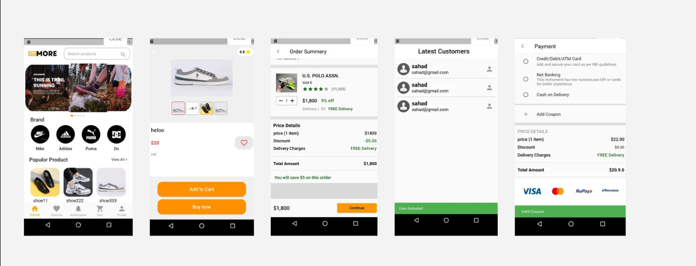

# FITMORE - Ecommerce App

Description:
E-commerce mobile application built using Flutter. The app provides a seamless shopping experience with features such as search, cart management, user authentication, and secure payment processing. Whether you're a Flutter enthusiast or an e-commerce developer looking for a solid foundation to build upon, this project offers a valuable resource to explore and contribute to.

## Key Features:

#### Product browsing with categories
#### Search functionality 
#### User authentication and profile management
#### Shopping cart management with add, remove, and update capabilities
#### Secure checkout process with payment integration
#### Order tracking and history
#### Admin dashboard for managing products and orders

## Technologies Used:

#### Flutter for the frontend
#### Hive for the database

## App Screens:

# Fitmore
# Fitmore
