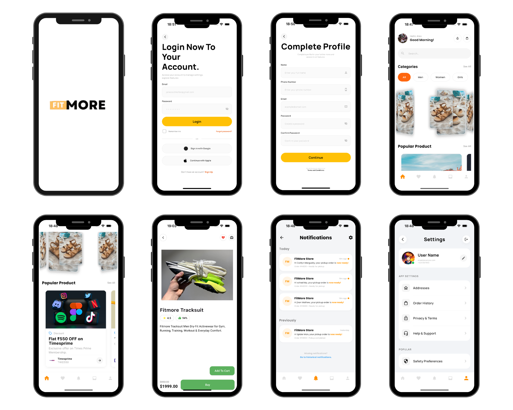

# FITMORE - E-Commerce App 🛍️📱

[](https://flutter.dev/)
[](https://dart.dev/)
[](https://docs.hivedb.dev/)

> A comprehensive e-commerce mobile application built with Flutter, designed to provide a seamless and secure shopping experience.

---

## 📖 Overview

**FITMORE** is a robust e-commerce mobile application that delivers a smooth shopping experience. It features product browsing, cart management, secure user authentication, and an administrative dashboard. Whether you're an e-commerce business looking for a reliable app or a developer seeking a solid Flutter foundation, FITMORE is designed to scale and perform.

## ✨ Key Features

- **🛍️ Product Browsing**: Seamlessly browse products categorized for easy discovery.
- **🔍 Advanced Search**: Quickly find products using optimized search functionality.
- **🔐 User Authentication**: Secure login, registration, and comprehensive profile management.
- **🛒 Cart Management**: Intuitive shopping cart with add, remove, and quantity update capabilities.
- **💳 Secure Checkout**: Streamlined checkout process integrated with secure payment gateways.
- **📦 Order Tracking**: Keep track of current orders and view historical purchases.
- **👨‍💻 Admin Dashboard**: Dedicated interface for managing products, categories, and user orders efficiently.

## 🛠️ Tech Stack

- **Frontend**: [Flutter](https://flutter.dev/) (Dart)
- **Local Storage/Database**: [Hive](https://docs.hivedb.dev/) (Fast, lightweight, NoSQL database for Flutter)

## 📸 App Screenshots



## 🚀 Getting Started

Follow these instructions to get a copy of the project up and running on your local machine for development and testing purposes.

### Prerequisites

- [Flutter SDK](https://flutter.dev/docs/get-started/install)
- IDE (VS Code, Android Studio, or IntelliJ IDEA) with Flutter and Dart plugins installed.

### Installation

1. **Clone the repository**
   ```bash
   git clone https://github.com/your-username/FITMORE.git
   cd FITMORE
   ```

2. **Install dependencies**
   ```bash
   flutter pub get
   ```

3. **Run the application**
   ```bash
   flutter run
   ```

## 🤝 Contributing

Contributions are what make the open-source community such an amazing place to learn, inspire, and create. Any contributions you make are **greatly appreciated**.

1. Fork the Project
2. Create your Feature Branch (`git checkout -b feature/AmazingFeature`)
3. Commit your Changes (`git commit -m 'feat: Add some AmazingFeature'`)
4. Push to the Branch (`git push origin feature/AmazingFeature`)
5. Open a Pull Request

## 📄 License

Distributed under the MIT License. See `LICENSE` for more information.

---
*Built with ❤️ using Flutter.*
